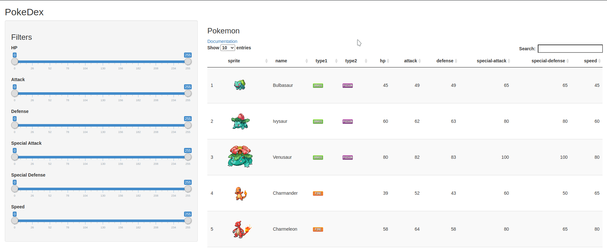
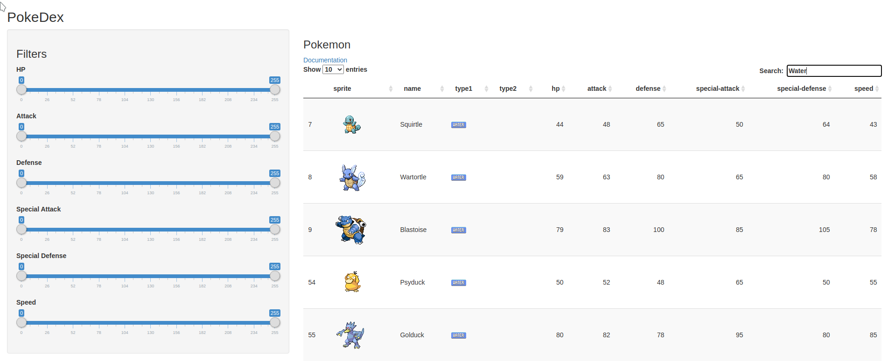

# PokeDex

This web application serves as a very rudimentary [PokeDex](https://bulbapedia.bulbagarden.net/wiki/Pok%C3%A9dex).

Check out the [demo](https://bagofbolts.shinyapps.io/PokeDex/)!

Check out the pitch!

## Data

The application uses data collected using [PokeAPI](https://pokeapi.co/).
This data only includes the first 151 Pokemon.

## Search

You can also search for specific Pokemon by their

- `ID`
- `Name`
- `Type`

> Note that when searching with a number as a query, the application checks for stats as well.

## Filters

You can filter for Pokemon based on the following stats:

- `HP`
- `Attack`
- `Defense`
- `Special Attack`
- `Special Defense`
- `Speed`

