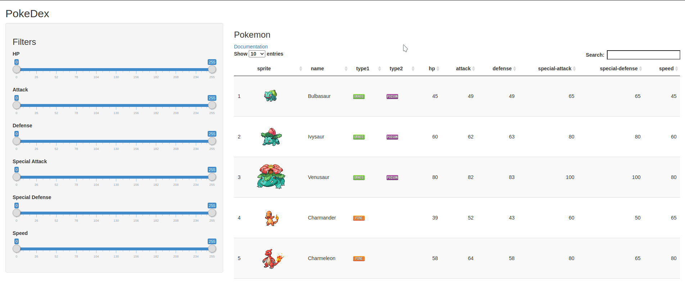
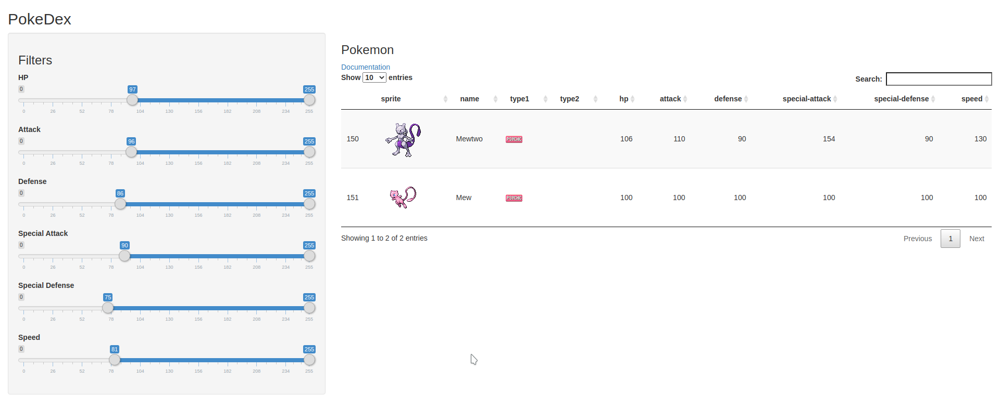

PokeDex
========================================================
author: Kelvin DeCosta
date: August 27, 2020
autosize: true

Introduction
========================================================

This presentation is done as part of the final course project for 'Developing Data Products' course in the Data Science Specialization track by John Hopkins University on Coursera.

The web application is hosted [here](https://bagofbolts.shinyapps.io/PokeDex/).

Application
========================================================

This web application serves as a very rudimentary [PokeDex](https://bulbapedia.bulbagarden.net/wiki/Pok%C3%A9dex).

Search
========================================================

You can perform a simple search using Pokemon `id`, `name` and `type`.

Filters
========================================================

You can filter for Pokemon based on their stats.

